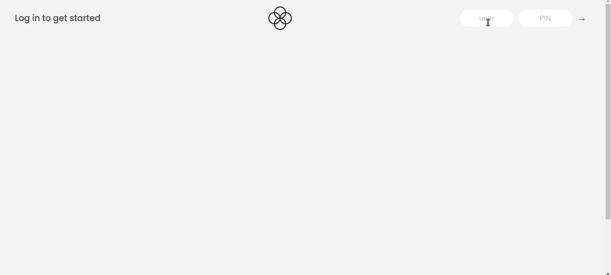

# Bankist

> # Description / Descrição

Bankist is a fictitious and minimalist online banking application that allows the user to:

- Log in with a username and password
- View and sort their monetary movements
- Transfer money to another account
- Request a loan from the bank
- Delete their account

Log in credentials:

- username: js | password: 1111
- username: jd | password 2222

Bugs that still need to be fixed:

- sorting transactions

[🔗 Click here to access / Clique aqui para acessar](https://bankist-vitorfnery.netlify.app/)

## 🛠️ Technologies / Tecnologias

- JavaScript
- HTML
- CSS
- Git e Github

## 📣 Contact / Contato

vitorfelipenery@gmail.com
